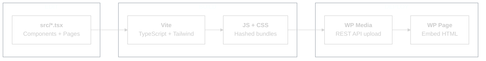
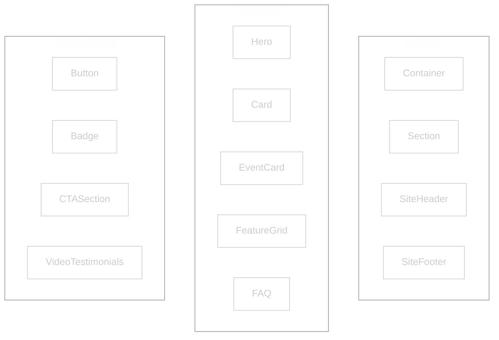
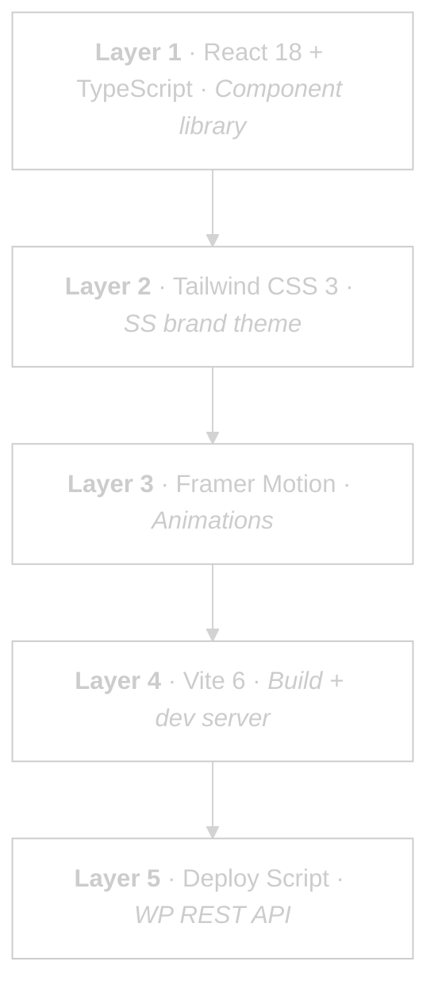

<picture>
  <source media="(prefers-color-scheme: dark)" srcset="assets/logo-dark.svg">
  <source media="(prefers-color-scheme: light)" srcset="assets/logo-light.svg">
  
</picture>

<br/>


**React design system for sellersessions.com.**
**Edit in Claude Code. Deploy to WordPress. No admin login needed.**

---

## What Is This?

A React + TypeScript component library that recreates the Seller Sessions website pages. Each page is built from reusable components with the SS brand system baked in -- purple gradients, glow cards, animated sections.

The deploy script uploads built assets to WordPress Media Library and updates page content via REST API. The live site stays on Elementor. New React pages deploy alongside it as Custom HTML blocks. First deploys go to private draft pages so Danny can preview before anything goes live.

---

## How It Works



---

## Pages

| Page | React file | Live WP ID | Status |
|------|-----------|-----------|--------|
| SSL 2026 Landing | `src/pages/SSLive2026.tsx` | 23003 (Elementor) | Ready to deploy |
| Events Hub | `src/pages/EventsHub.tsx` | TBD | Ready to deploy |
| Events Archive | `src/pages/EventsArchive.tsx` | TBD | Ready to deploy |

---

## Components



All components use the SS brand tokens. Animations via Framer Motion. Icons via Lucide.

---

## Brand Tokens

| Token | Hex | Usage |
|-------|-----|-------|
| `ss-purple` | `#461499` | Primary purple |
| `ss-purple-light` | `#753EF7` | Accent purple |
| `ss-purple-dark` | `#0C0322` | Deep background |
| `ss-accent` | `#753EF7` | Links, highlights |
| `ss-gold` | `#FBBF24` | Gold accents |
| `ss-bg` | `#0C0322` | Page background |
| `ss-bg-card` | `#1a1a2e` | Card surfaces |
| `ss-text` | `#FAFAFC` | Primary text |

---

## Quick Start

**Option A: Local preview**

```
npm install
npm run dev            # localhost:5173
```

**Option B: Deploy to WordPress**

```
cp .env.example .env   # Add WP Application Password
npm run deploy -- --page ssl2026              # Draft test page
npm run deploy -- --page ssl2026 --promote    # Replace live page
```

---

## The Stack



---

## Known Gaps + Roadmap

| Working | Not yet |
|---------|---------|
| Local dev server | First WP deploy (needs Application Password) |
| Build pipeline | Test page creation |
| 13 components | CI/CD (not needed yet) |
| 3 page compositions | Multi-page routing |
| Brand token system | A/B testing |
| WP embed generation | Visual regression |

---

## Build Timeline

| Date | What was built |
|------|---------------|
| 13 Jan | Design system created by Alex (components, pages, brand tokens) |
| 24 Feb | Deploy pipeline, ClaudeFlow scaffolding, GitHub repo, Tailwind config fix |

---

*13 components. 3 pages. Zero-login deploys.*
*Last updated: 2026-02-24*
