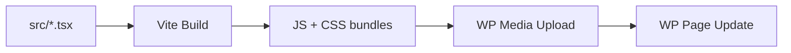

# Seller Sessions Page Builder

React + TypeScript design system for sellersessions.com. Builds WordPress-compatible pages and deploys via REST API -- no WP admin login needed.

```
Danny says         Claude does              Result
"change X"    -->  edit src/*.tsx       -->  source updated
"show me"     -->  npm run dev          -->  local preview
"ship it"     -->  npm run deploy       -->  live on WP
```

## Architecture



## Setup

```bash
npm install
cp .env.example .env   # Add WP credentials
npm run dev            # localhost:5173
```

## Deploy

```bash
npm run deploy -- --page ssl2026              # Draft test page
npm run deploy -- --page ssl2026 --promote    # Replace live page
```

## Tech Stack

React 18 | TypeScript | Tailwind CSS 3 | Framer Motion | Vite 6

## Components

`Button` `Card` `Container` `Section` `Badge` `Hero` `EventCard` `FeatureGrid` `CTASection` `FAQ` `SiteHeader` `SiteFooter` `VideoTestimonials`

## Pages

| Page | File | WP Slug |
|------|------|---------|
| SSL 2026 Landing | `src/pages/SSLive2026.tsx` | `/sp/seller-sessions-live-2026/` |
| Events Hub | `src/pages/EventsHub.tsx` | `/events/` |
| Events Archive | `src/pages/EventsArchive.tsx` | `/events/archive/` |
