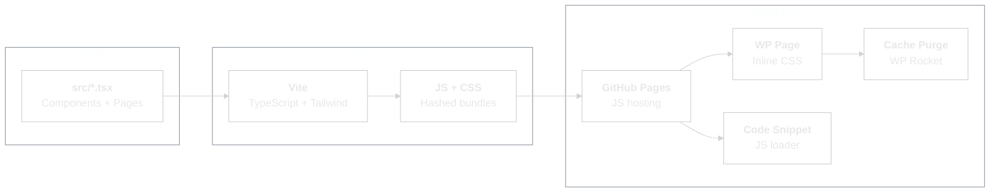
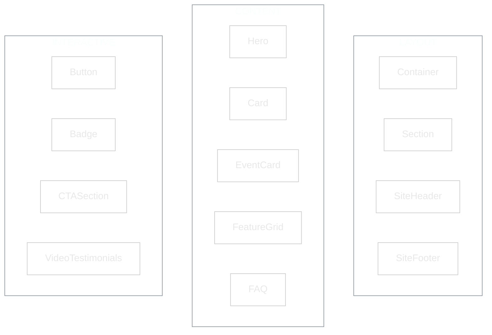
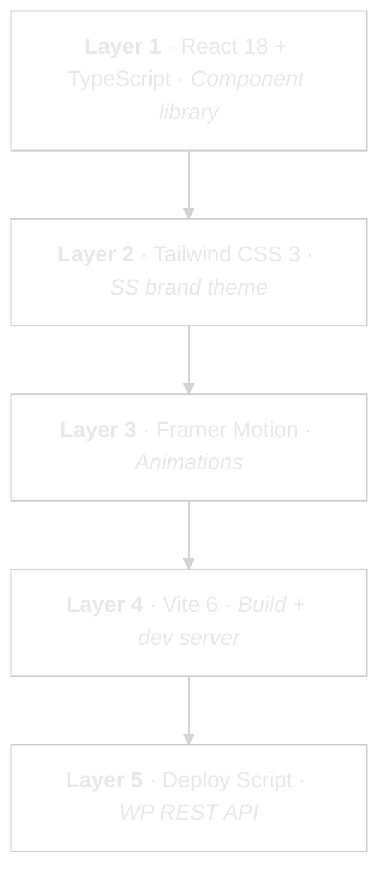

<picture>
  <source media="(prefers-color-scheme: dark)" srcset="assets/logo-dark.svg">
  <source media="(prefers-color-scheme: light)" srcset="assets/logo-light.svg">
  
</picture>

<br/>


**React design system for sellersessions.com.**
**Edit in Claude Code. Deploy to WordPress. No admin login needed.**

---

## What Is This?

A React + TypeScript component library that recreates the Seller Sessions website pages. Each page is built from reusable components with the SS brand system baked in -- purple gradients, glow cards, animated sections.

The deploy script pushes built assets to GitHub Pages and updates page content via WordPress REST API. JS is loaded via the Code Snippets plugin (Wordfence strips `<script>` from page content). CSS is inlined. The live site stays on Elementor. New React pages deploy alongside it. First deploys go to draft pages so Danny can preview before anything goes live.

---

## How It Works



---

## How Changes Work

**Why this exists:** Previously, every page change required logging into WordPress and editing Elementor blocks. Now Danny describes changes in plain English, Claude edits the source, and deploys in under 3 minutes.

```
 ITERATION CYCLE -- SS PAGE BUILDER
 ═══════════════════════════════════════════════════════════════════

 WHAT CHANGES                WHERE IT LIVES              WHO
 ─────────────────────────────────────────────────────────────────
 Text, copy, stats,       │ src/pages/*.tsx             │ Danny
 FAQs, prices, dates      │ (hardcoded in TSX)          │ via Claude
 ─────────────────────────┼─────────────────────────────┼──────────
 Images, videos           │ Remote URLs in TSX          │ Danny
                          │ (hosted on WP media)        │ via Claude
 ─────────────────────────┼─────────────────────────────┼──────────
 Styles, colours,         │ tailwind.config.js          │ Danny
 spacing, fonts           │ src/index.css               │ via Claude
                          │ inline styles in TSX        │ or Alex
 ─────────────────────────┼─────────────────────────────┼──────────
 UI components,           │ src/components/*.tsx         │ Danny
 layout, new sections     │                             │ or Alex
 ─────────────────────────┼─────────────────────────────┼──────────
 New pages                │ src/pages/ + deploy.js      │ Danny
                          │ + Code Snippet on WP        │ via Claude
 ─────────────────────────┴─────────────────────────────┴──────────


 THE PIPELINE (same for ALL change types)
 ═══════════════════════════════════════════════════════════════════

 ┌──────────┐    ┌──────────────┐    ┌──────────────────────────┐
 │  EDIT    │───>│  BUILD       │───>│  DEPLOY                  │
 │  source  │    │  Vite builds │    │  npm run deploy --page X │
 │  files   │    │  IIFE JS +   │    │                          │
 └──────────┘    │  CSS bundle  │    │  1. Push JS → GH Pages   │
                 └──────────────┘    │  2. Inline CSS → WP API  │
                                     │  3. Update Code Snippet  │
                                     │  4. Purge WP Rocket      │
                                     └────────────┬─────────────┘
                                                   │
                                     ┌─────────────▼─────────────┐
                                     │  VERIFY                   │
                                     │  Open page (no ?nocache   │
                                     │  needed -- auto-purged)   │
                                     └────────────┬──────────────┘
                                                   │
                                          happy? ──┤── no ──> back to EDIT
                                                   │
                                                  done


 SPEED BY CHANGE TYPE
 ═══════════════════════════════════════════════════════════════════

 Tier 1  Text/data       ~3 min    Edit TSX → deploy
 Tier 2  Styles          ~3 min    Edit CSS/config → deploy
 Tier 3  Images          ~5 min    Upload to WP media → edit URL → deploy
 Tier 4  Components     ~10-20m    Edit/create component → test → deploy
 Tier 5  New pages      ~30+ min   Create page + config + snippet mapping


 TWO WORKFLOWS
 ═══════════════════════════════════════════════════════════════════

 DANNY (fast loop):
 "Change X" → Claude edits → Claude deploys → verify → done

 ALEX (PR loop):
 Alex edits → pushes branch → PR → Danny approves → Claude deploys
 (Alex has repo access but NOT .env / WP deploy credentials)


 REMAINING FRICTION
 ═══════════════════════════════════════════════════════════════════

 [!] No WP-context preview without deploying
 [!] Images need separate upload to WP media first
 [!] Every change = full rebuild (no incremental)
```

---

## Pages

| Page | React file | Live WP ID | Status |
|------|-----------|-----------|--------|
| SSL 2026 Landing | `src/pages/SSLive2026.tsx` | 23003 (Elementor) | Ready to deploy |
| Events Hub | `src/pages/EventsHub.tsx` | TBD | Ready to deploy |
| Events Archive | `src/pages/EventsArchive.tsx` | TBD | Ready to deploy |

---

## Components



All components use the SS brand tokens. Animations via Framer Motion. Icons via Lucide.

---

## Brand Tokens

| Token | Hex | Usage |
|-------|-----|-------|
| `ss-purple` | `#461499` | Primary purple |
| `ss-purple-light` | `#753EF7` | Accent purple |
| `ss-purple-dark` | `#0C0322` | Deep background |
| `ss-accent` | `#753EF7` | Links, highlights |
| `ss-gold` | `#FBBF24` | Gold accents |
| `ss-bg` | `#0C0322` | Page background |
| `ss-bg-card` | `#1a1a2e` | Card surfaces |
| `ss-text` | `#FAFAFC` | Primary text |

---

## Quick Start

**Option A: Local preview**

```
npm install
npm run dev            # localhost:5173
```

**Option B: Deploy to WordPress**

```
cp .env.example .env   # Add WP Application Password
npm run deploy -- --page ssl2026              # Draft test page
npm run deploy -- --page ssl2026 --promote    # Replace live page
```

---

## The Stack



---

## Content Guardrails

Every page has a `.spec.md` file that Claude reads before making content changes. It defines what each section is for, how it should read, and what limits keep the layout intact.

```
 CONTENT UPDATE FLOW
 ═══════════════════════════════════════════════════════════════════

 ┌────────────┐    ┌────────────┐    ┌────────────┐    ┌──────────┐
 │ READ SPEC  │───>│   DRAFT    │───>│  VALIDATE  │───>│ EDIT TSX │
 │ Purpose,   │    │ Write or   │    │ Limits?    │    │          │
 │ voice,     │    │ receive    │    │ Grid safe? │    │          │
 │ limits     │    │ content    │    │ Signal?    │    │          │
 └────────────┘    └────────────┘    └────────────┘    └────┬─────┘
                                                            │
                                          ┌─────────────────▼──────────────────┐
                                          │  BUILD → SCREENSHOT → DANNY REVIEW │
                                          └────────────────────────────────────┘


 WHAT THE SPEC DEFINES (per section)
 ═══════════════════════════════════════════════════════════════════

 PURPOSE     Why this section exists (4MAT: WHY / WHAT / HOW / WHAT IF)
 VOICE       How copy should read (direct facts vs aspirational vs proof)
 LIMITS      Character/word counts that fit the component layout
 GRID RULES  Exact item counts (3 cards, 5+5 list items, 2x2 speakers)
 DATA SOURCE Where real content comes from (reference files, not guesses)


 4MAT SECTION MAP (SSL 2026)
 ═══════════════════════════════════════════════════════════════════

 WHY (motivation)              WHAT (information)
 ┌─────────────────────────┐   ┌─────────────────────────┐
 │ 1. Hero                 │   │ 4. Modular Format       │
 │ 2. Built for Innovators │   │ 8. Speakers             │
 │ 3. For / Not For        │   │ 9. Agenda               │
 └─────────────────────────┘   └─────────────────────────┘

 HOW (application)             WHAT IF (outcomes)
 ┌─────────────────────────┐   ┌─────────────────────────┐
 │ 5. Crowd Image / Vibe   │   │ 10. Written Testimonials│
 │ 6. Hands-On Workshop    │   │ 11. Event Details Card  │
 │ 7. Why This Format      │   │ 12. Video Testimonials  │
 └─────────────────────────┘   │ 13. FAQ                 │
                               │ 14. Final CTA           │
                               └─────────────────────────┘


 CROSS-SECTION RULES
 ═══════════════════════════════════════════════════════════════════

 [1] Grid parity     Every grid must have exact item count (no dangling cards)
 [2] Height balance   Text lengths within a row ±20% of each other
 [3] Data sync        Date, venue, price, names match across all sections
 [4] No orphans       Change a name in one section → check all others
```

| Page | Spec file |
|------|-----------|
| SSL 2026 | `src/pages/SSLive2026.spec.md` |

---

## Known Gaps + Roadmap

| Working | Not yet |
|---------|---------|
| Local dev server | CI/CD (not needed yet) |
| Build pipeline | Multi-page routing |
| WP deploy pipeline (REST API) | A/B testing |
| Test page (ID 28352) | Visual regression |
| 13 components | Events Hub + Archive pages |
| 3 page compositions | Promote test to live |
| Brand token system | |
| Google Fonts (Inter, Poppins, Plus Jakarta Sans) | |
| Full-width template (`elementor_canvas`) | |
| Code Snippets JS loading (Wordfence bypass) | |
| Auto cache purge (WP Rocket) | |

---

## Build Timeline

| Date | What was built |
|------|---------------|
| 13 Jan | Design system created by Alex (components, pages, brand tokens) |
| 24 Feb | Deploy pipeline, ClaudeFlow scaffolding, GitHub repo, Tailwind config fix |
| 25 Feb | Tailwind specificity fix, Google Fonts, full-width template, Wordfence bypass via Code Snippets, auto cache purge, iteration cycle docs |
| 25 Feb | Content guardrails: page spec files (.spec.md), 4MAT section mapping, content update workflow |

---

*13 components. 3 pages. Zero-login deploys. Content guardrails built in.*
*Last updated: 2026-02-25*
